# E-shop
Проект является приложением для локального интернет магазина.

## Краткое описание проекта
1. Приложение включается в себя клиентскую часть, в которой пользователь может: просматривать товары по категориям, осуществлять заказ, просматривать историю заказов, восстановить аккаунт на случай если забыл пароль. В части администратора пользователь может: добавлять, удалять и изменять товары и добавлять специальные предложения на главный экран для пользователя;
2. В проекте используется Firebase Realtime Database в которой хранятся все данные по заказам и клиентам, а также Firebase Storage в которой хранятся изображения;
3. Приложение подходит для местных магазинов у которых небольшая база клиентов.

## Характеристики проекта

### SDK
|Min SDK|Max SDK|
|--|--|
|27|31|

### Тестирование
Тестирование осуществлялось на виртуальном устройстве google pixel 1, Android 8.1.

## Задачи в проекте

### Реализовано

#### Общее
- [x] MVP версия приложения;
- [x] Авторизация и аутентификация пользователя;
- [x] Восстановление аккаунта;
- [x] Использование Firebase как backend'a для приложения;
- [x] Использование Recycleview и Gridview для списков;
- [x] Загрузка изображений на сервер и рендер их в приложении;

#### Часть обычного пользователя
- [x] Дизайн приложения для обычного пользователя;
- [x] Главный экран с специальными предложениями и небольшой группой товаров для превью категории;
- [x] Экран деталей товара с функциями добавления и удаления из корзины;
- [x] Страница категории с перечнем всех товаров по категории;
- [x] Всплывающее меню для перехода на экраны приложения;
- [x] Корзина товаров с функциями добавления и удаления товаров;
- [x] Страница просмотра истории заказов;
- [x] Добавление и удаление товаров из любимых товаров;
- [x] Страница просмотра любимых товаров.

### Не реализовано

#### Часть админа
- [ ] Аутентификация админа системы;
- [ ] Дизайн экрана "Товары";
- [ ] Дизайн экрана "Специальные предложения";
- [ ] Добавление, удаление и изменение товара;
- [ ] Добавление, удаление и изменение специального предложения для клиента.

#### Общее
- [ ] Русская локализация приложения;
- [ ] Дизайн темной темы;

## Скриншоты приложения

| Иконка приложения  | Аутентификация |
|--|--|
|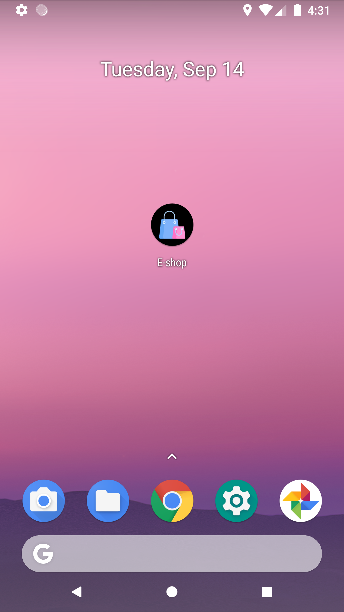 | 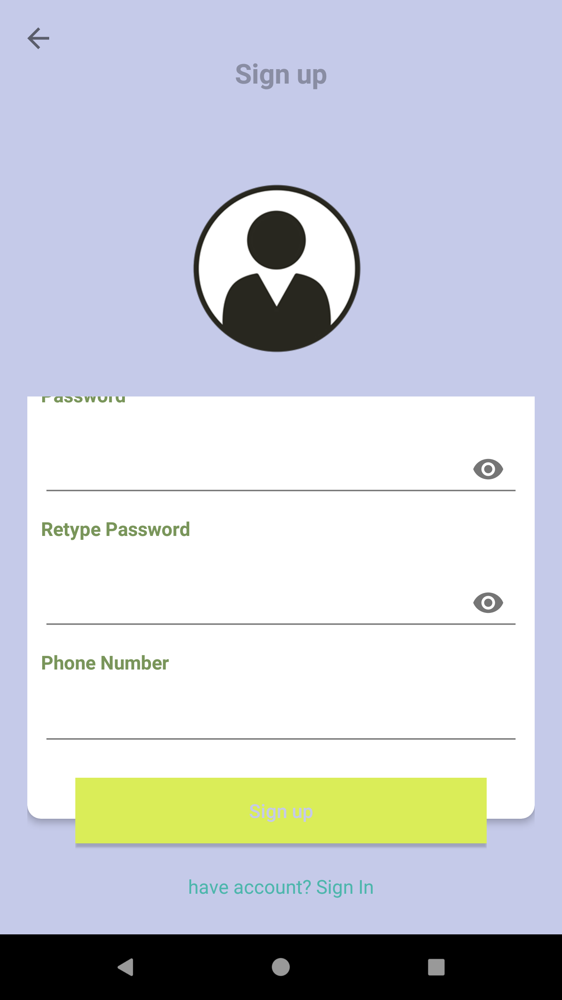 |

| Авторизация | Восстановление | Главный экран |
|--|--|--|
| 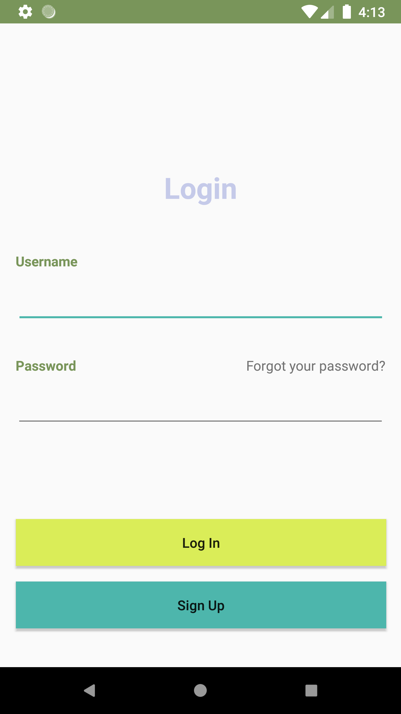 | 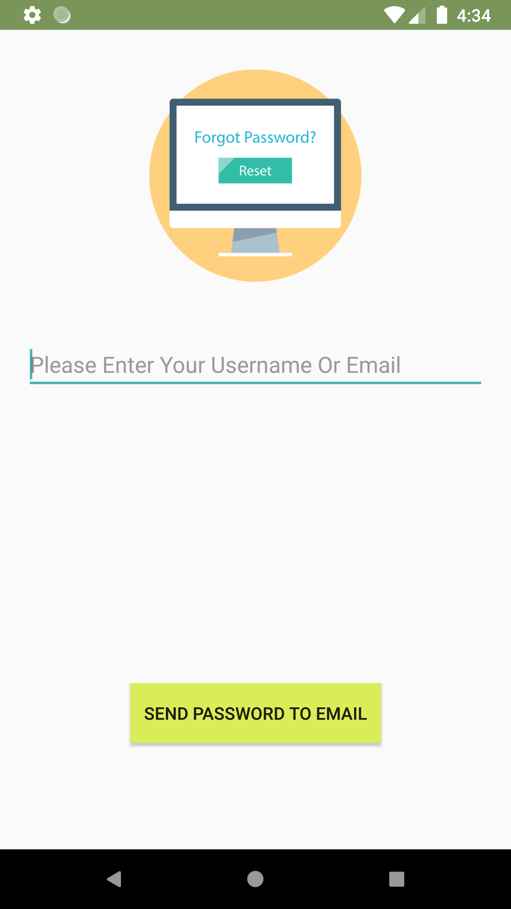 |  |

| Меню | Категория товаров | Детали товара |
|--|--|--|
| 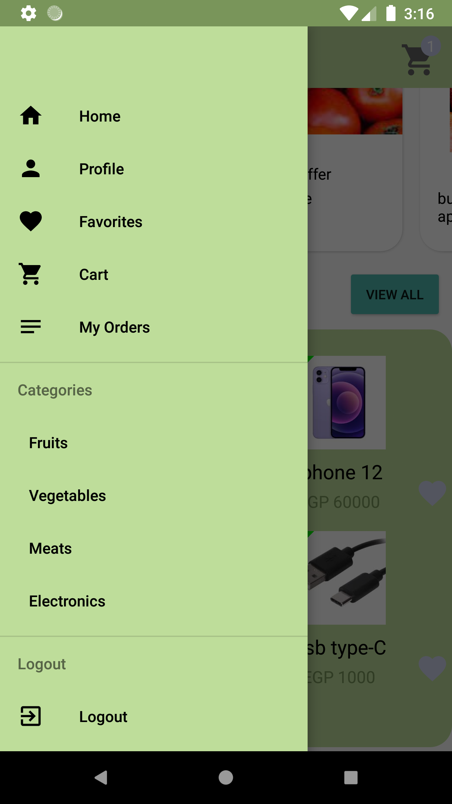 | 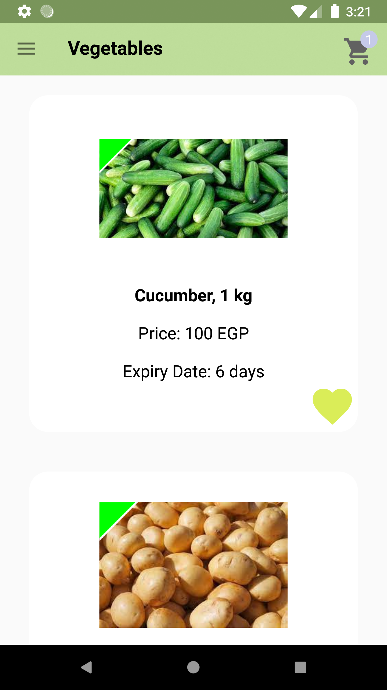 | 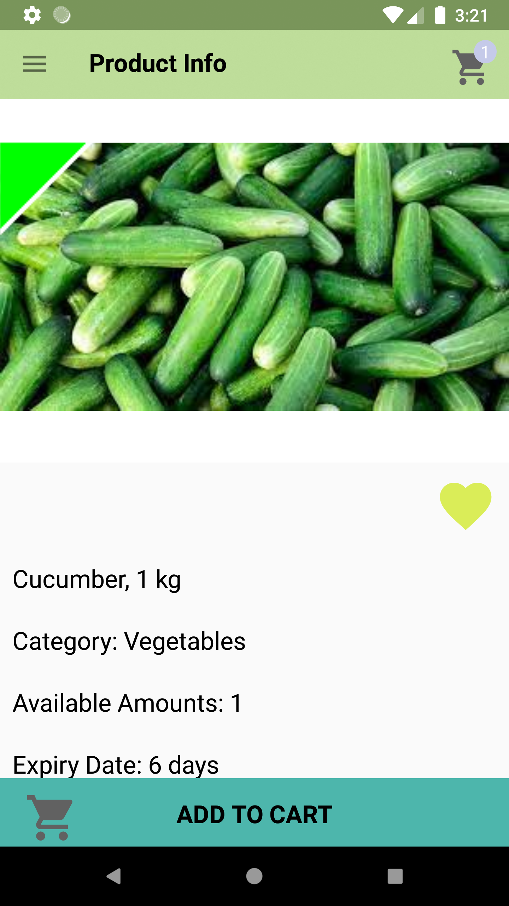 |

| Детали товара (добавить в корзину) | Детали товара (товар в корзине) | Профиль пользователя |
|--|--|--|
| 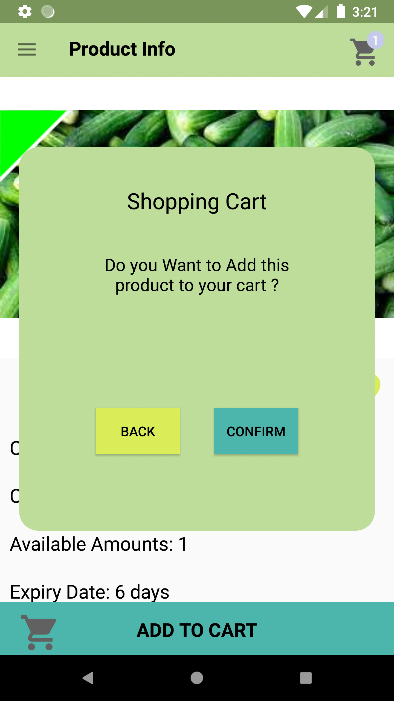 | 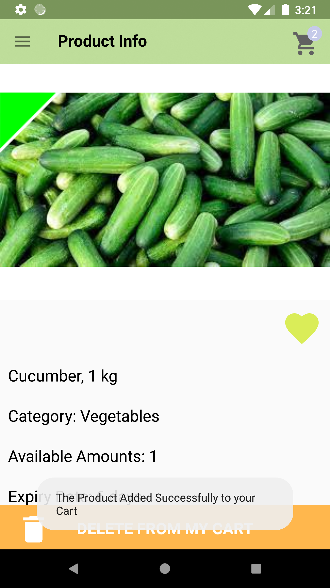 | 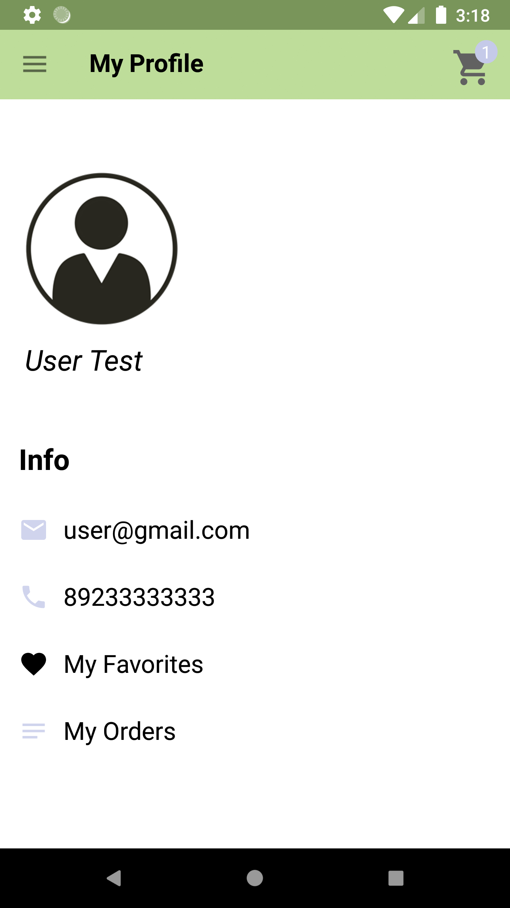 |

| Любимые товары | Подтверждение заказа | История заказов |
|--|--|--|
| 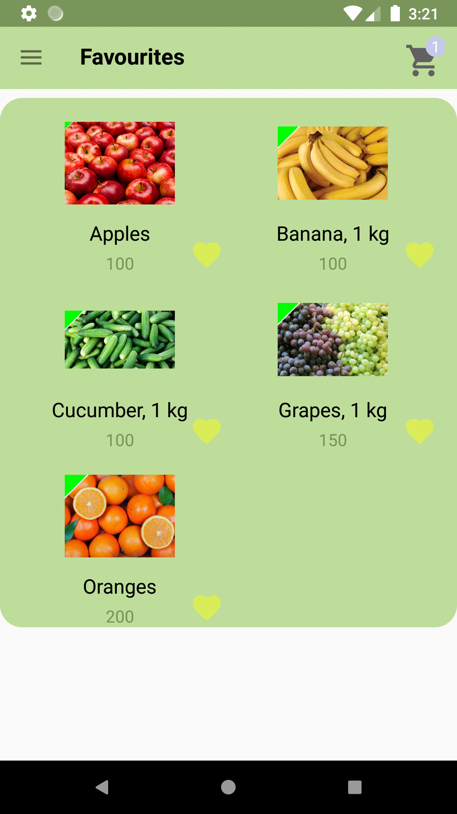 | 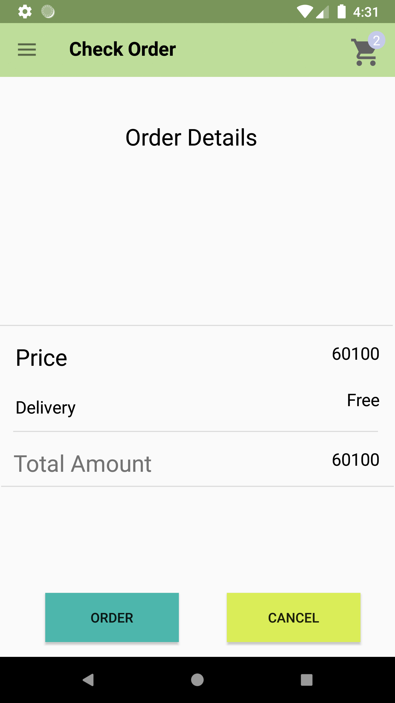 | 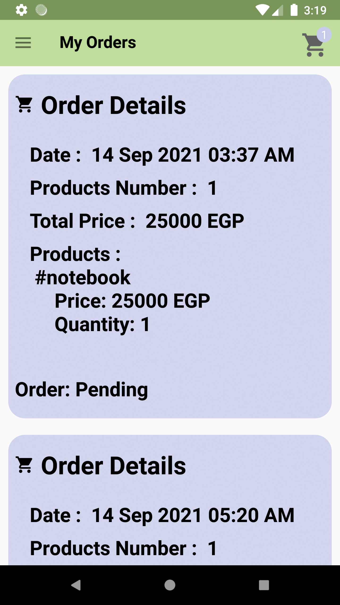 

## Установка проекта
1. Клонировать проект;
2.  [Создать хранилище в Firebase console](https://console.firebase.google.com/u/0/);
3. Создать google-services.json в настройках проекта Firebase console;
4. Поместить google-services.json в директорию проекта app;
5. Подключить Realtime Database в Firebase console и установить правила:
```
{	
	"rules": {
	  ".read": true,
	  ".write": true
	}
}
```
6. Подключить Storage в Firebase console и установить правила:
```
rules_version = '2';
service firebase.storage {
  match /b/{bucket}/o {
    match /{allPaths=**} {
      allow read, write: if true;
    }
  }
}
```
7. Подключить Authentication в Firebase console и установить Sign-in providers:
```
Email/Password
```

### Скриншоты схемы данных в Firebase
| Authentication sign-in-method | Authentication users |
|--|--|
| 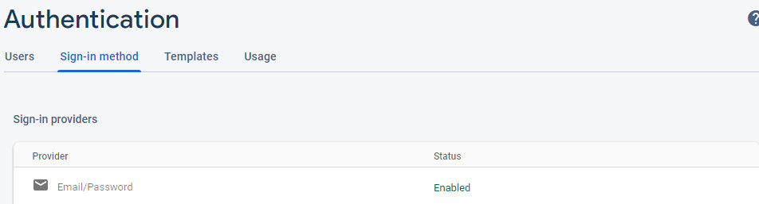 | 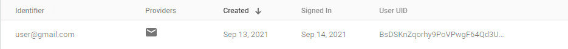 |

| Realtime Database | Realtime Database rules |
|--|--|
| 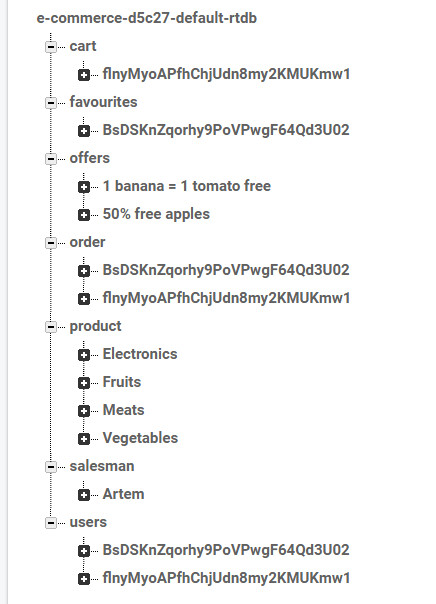 | 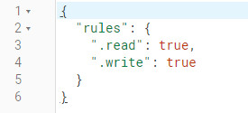 |

| Storage | Storage rules |
|--|--|
| 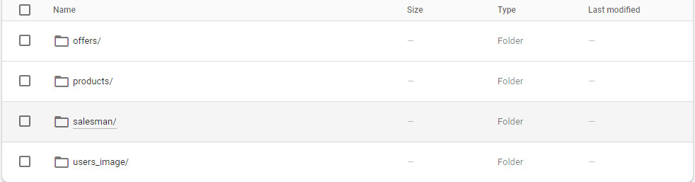 | 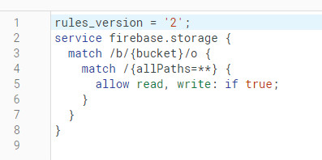 |


